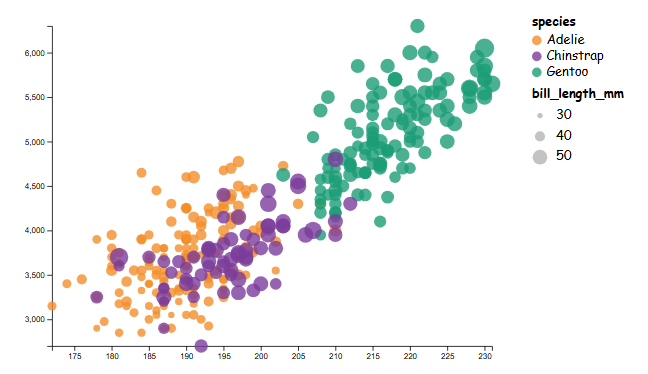
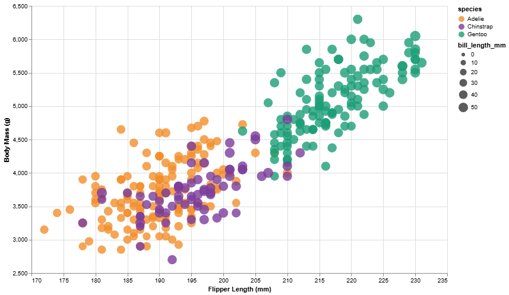
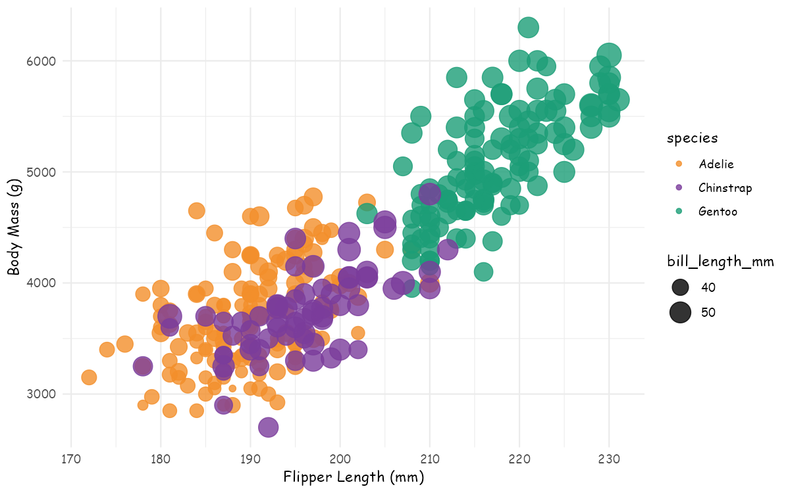

# a2 - Penglings Charts
## Timothy Hutzley

# D3.js

D3 provided the most control over making visualization but also required the most setup and code. Everything from scales to axes to legends and tooltips all had to be implemented individually within the code making it the longest file. For loading the CSV data the actual function was very easy to implement but a local server had to be ran to test it which I did using the built-in python http.server command. Overall, while the graph itself could be made with no limitations, it did require a solid amount of effort and written code to get there in comparison. 

# Altair

Altair was fairly easy to work with and required significantly less code to produce the same visualization. The style made it straightforward to map the data. Some things required some more manual work such as disabling zero-based axes and tuning the size scale so the circles did not appear too large by default. Adding hover tooltips was fairly simple and required very little extra effort which was nice. The only thing that required a bit more effort over every other visualization was surprisingly changing the font for everything as they all had to be changed individually and couldn't all be moved to Comic Sans MS all at once like most other tools. Overall, Altair felt well suited for quickly recreating the visualization with minimal setup but still having a fair amount of control over the visualization itself.

# Vega-Lite

Vega-Lite was interesting to use since the visualization is defined entirely through JSON. This made the structure of the visualization very explicit and honestly pretty easy to parse through for any bugs or additions. It did require some specifics relating to the strcuture of the code and defining scales and legends. Recreating the example required manually specifying scales and legend values, especially for the bubble sizes. In my opinion, vega-lite provided a very nice way to kind of describe the visualization within the code itself making it easy to follow in comparison to other tools like d3.

# R

The example visualization being used seemed to be made through R and ggplot2 which was interesting as mine actually turned out a little different after some changes. At first I made a chart and saved it as a png which looked near identical to the example and it was done in very few lines of code and not too difficult to recreate, epecially as I have some experience in R. Pretty much all of the default aesthetic of ggplot2 fit the example. When I decided to add interactivity using hover tooltips, the code itself was extremely easy to add but I had some troubles with installing and using R libraries, especially relating to out of date versions I couldn't seem to update. Eventually when I got to save the chart as html, the bill length legend had disappeared and replcing it would likely double the code necessary just for a legend. Overall, I found R to be extremely easy and useful for a quick chart to just look at, but once I began adding interactivity the complexity jumped a fair amount all at once.

# Tableau

Tableau was the fastest tool to get a working scatterplot, as most of the plot could be made entriely just dragging and dropping fields into the right spot once I connected to the data. One challenge was that Tableau aggregates measures by default, which initially resulted in summed values rather than individual circle markers as observation which required some time to figure out. Most of the visualization implementation was straightforward however, trying to control the size of the scale was limited compared to code-based tools and many of the markers appear more uniform. Overall, Tableau made it easy to initially explore and visually view the data, but offered less precision in general.

# Technical Achievements

- Implemented consistent visuals in terms of position, color, and size across the five different visualizations
- Added hover tooltips for individual data points in all five different data visualizations
- Created custom legends for both species and bill length in all visualizations except for R due to the limitations explained above where bill length legend is not included.

# Design Achievements

- Applied a consistent color scheme across all tools to represent species
- Used Comic Sans MS as a consistent font choice across all visualizations
- Tuned bubble sizes as best as I could to maintain readability while still showing the variation in bill length
- Included gridlines for all charts to improve readability
